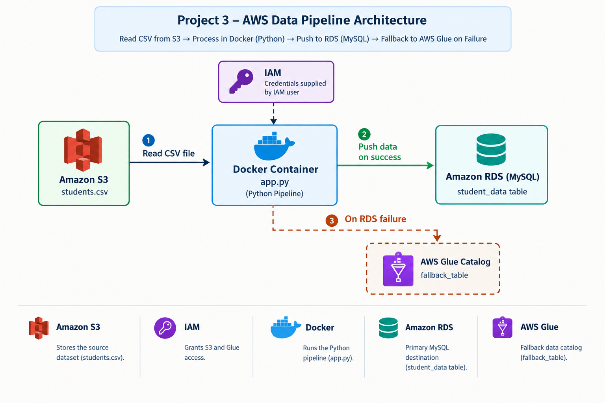

# Internship Project 3 — Data Ingestion from S3 to RDS with Fallback to AWS Glue


A Dockerized Python application that reads a CSV dataset from Amazon S3, pushes it into an Amazon RDS (MySQL-compatible) database, and automatically falls back to AWS Glue Data Catalog if the RDS write fails. This project demonstrates a resilient, cloud-native ingestion pattern using containerization and multiple AWS services working together.

---

## Table of Contents

- [Overview](#overview)
- [Architecture](#architecture)
- [Tech Stack](#tech-stack)
- [Repository Structure](#repository-structure)
- [How It Works](#how-it-works)
- [Environment Variables](#environment-variables)
- [Screenshots](#screenshots)
- [Challenges and Solutions](#challenges-and-solutions)
- [Outcome](#outcome)
- [Author](#author)

---

## Overview

Production data pipelines rarely tolerate a single point of failure gracefully. A job that writes exclusively to a relational database fails completely the moment that database becomes unreachable — during maintenance, a network partition, or an outage. This project addresses that risk with a small but realistic ingestion pipeline that degrades gracefully: if the primary destination (Amazon RDS) cannot accept the data, the pipeline automatically re-routes the dataset's metadata into AWS Glue Data Catalog instead of failing outright, keeping the data discoverable and queryable even while RDS is down.

The entire pipeline is packaged as a Docker image, so it runs identically on a laptop, an EC2 instance, or inside a CI/CD job, without depending on the host machine's Python installation or library versions.

### Objectives

- Read a CSV dataset from an Amazon S3 bucket using `boto3` and `pandas`
- Attempt to load the dataset into an Amazon RDS (MySQL-compatible) table using `SQLAlchemy` and `PyMySQL`
- Automatically register the dataset in AWS Glue Data Catalog if the RDS write fails
- Package the application as a portable Docker image, configured entirely through environment variables
- Demonstrate both the success path and the fallback path with verifiable evidence

---

## Architecture



The container reads the CSV object from S3 using credentials issued to a scoped IAM user. The parsed data is pushed into the RDS MySQL table if the connection succeeds. Only if that RDS write raises an exception does the application fall back to creating a database and table entry in AWS Glue Data Catalog that points back at the same S3 object, so the dataset remains queryable through Glue-integrated tooling such as Amazon Athena.

---

## Tech Stack

| Service / Tool | Role |
|---|---|
| Amazon S3 | Stores the source dataset (`students.csv`) |
| Amazon RDS (MySQL) | Primary relational database target |
| AWS Glue Data Catalog | Fallback metadata registry, used only on RDS failure |
| AWS IAM | Issues scoped credentials for S3 and Glue access |
| Docker | Packages the application into a portable image |
| Python 3.9 | Runtime for the ingestion script |
| boto3 | AWS SDK for Python — S3 and Glue API calls |
| pandas | Parses CSV bytes into a structured DataFrame |
| SQLAlchemy + PyMySQL | Database engine and driver for the RDS write |

---

## Repository Structure

```
├── app.py                 # Main ingestion script (S3 -> RDS -> Glue fallback logic)
├── Dockerfile              # Container image definition (python:3.9-slim base)
├── requirements.txt         # Pinned Python dependencies
├── students.csv            # Sample dataset uploaded to S3 for testing
├── README.md               # Project documentation
└── screenshots/            # Evidence of setup, execution, and verification
```

---

## How It Works

The script is organized into four functions, executed in sequence by `main()`:

- **`read_csv_from_s3(bucket, key)`** — uses the boto3 S3 client to fetch the object, decodes it, and loads it into a pandas DataFrame with `pd.read_csv`.
- **`push_to_rds(df)`** — builds a SQLAlchemy engine from a `mysql+pymysql` connection string, with a 10-second connect timeout so a dead endpoint fails fast rather than hanging, and writes the DataFrame using `df.to_sql(if_exists="append")`.
- **`fallback_to_glue()`** — called only from the `except` block around `push_to_rds`. Uses the boto3 Glue client to create a database (if not already present) and a table whose `StorageDescriptor.Location` points at the S3 prefix containing the CSV.
- **`main()`** — validates that all required environment variables are present, then calls `read_csv_from_s3`, followed by a `try/except` around `push_to_rds`, invoking `fallback_to_glue()` in the `except` branch.

This structure means the fallback triggers on *any* exception raised during the RDS write — a wrong hostname, an expired password, a security group blocking the connection, or the database being temporarily unavailable — without needing separate handling for each failure mode.

### Dockerfile

The image is built from `python:3.9-slim` to keep it small. Dependencies are installed from `requirements.txt` before the application code is copied in, so Docker's layer cache can skip the `pip install` step on rebuilds where only `app.py` changes.

```dockerfile
FROM python:3.9-slim
WORKDIR /app
COPY requirements.txt .
RUN pip install --no-cache-dir -r requirements.txt
COPY app.py .
CMD ["python", "app.py"]
```

### Running the container

**Success case** (valid RDS endpoint):

```bash
docker run --rm \
  -e AWS_ACCESS_KEY_ID="<access-key>" \
  -e AWS_SECRET_ACCESS_KEY="<secret-key>" \
  -e AWS_REGION="us-east-1" \
  -e S3_BUCKET="<bucket-name>" \
  -e S3_KEY="students.csv" \
  -e RDS_HOST="<rds-endpoint>" \
  -e RDS_PORT="3306" \
  -e RDS_USER="admin" \
  -e RDS_PASSWORD="<rds-password>" \
  -e RDS_DB_NAME="studentdb" \
  -e RDS_TABLE_NAME="student_data" \
  s3-rds-glue-app
```

**Fallback case** (RDS unreachable, e.g. wrong host):

```bash
docker run --rm \
  -e AWS_ACCESS_KEY_ID="<access-key>" \
  -e AWS_SECRET_ACCESS_KEY="<secret-key>" \
  -e AWS_REGION="us-east-1" \
  -e S3_BUCKET="<bucket-name>" \
  -e S3_KEY="students.csv" \
  -e RDS_HOST="wrong-endpoint.rds.amazonaws.com" \
  -e RDS_PORT="3306" \
  -e RDS_USER="admin" \
  -e RDS_PASSWORD="<rds-password>" \
  -e RDS_DB_NAME="studentdb" \
  -e GLUE_DB_NAME="fallback_db" \
  -e GLUE_TABLE_NAME="fallback_table" \
  -e GLUE_S3_LOCATION="s3://<bucket-name>/data/" \
  s3-rds-glue-app
```

---

## Environment Variables

No credentials or endpoints are hardcoded in the script. Every external value is read from an environment variable at runtime, which is what allows the same Docker image to be pointed at different buckets, databases, or Glue catalogs without rebuilding it.

| Variable | Purpose |
|---|---|
| `AWS_ACCESS_KEY_ID` / `AWS_SECRET_ACCESS_KEY` | IAM credentials used for all boto3 calls |
| `AWS_REGION` | AWS region for S3, RDS, and Glue |
| `S3_BUCKET` / `S3_KEY` | Bucket name and object key of the source CSV |
| `RDS_HOST` / `RDS_PORT` / `RDS_USER` / `RDS_PASSWORD` / `RDS_DB_NAME` / `RDS_TABLE_NAME` | Connection details for the target RDS MySQL instance |
| `GLUE_DB_NAME` / `GLUE_TABLE_NAME` / `GLUE_S3_LOCATION` | Fallback database, table name, and S3 location registered on failure |

### Table schema (RDS)

| Column | Type |
|---|---|
| col1 | VARCHAR(50) |
| col2 | VARCHAR(100) |

---

## Screenshots

### RDS instance running


### MySQL Workbench — successful connection to RDS


### Database and table creation


### IAM user — access key generated


### Docker container log — success case


### RDS data verified in MySQL Workbench


### Docker container log — fallback case


### AWS Glue — fallback database created


### AWS Glue — fallback table details


### Docker image built


### S3 bucket contents


### IAM user permissions


### GitHub repository


---

## Challenges and Solutions

**RDS connection timeout from the local machine**
The RDS instance had "Publicly accessible" set to No, and the security group did not permit inbound traffic from the local IP. Fixed by enabling public accessibility and adding an inbound rule for MySQL/Aurora (port 3306) scoped to the workstation's IP.

**Docker Desktop engine not starting on Windows**
Docker Desktop reported the engine as stopped because Windows Subsystem for Linux 2 (WSL 2) was not installed. Fixed by running `wsl --install`, restarting the system, and confirming the Docker engine started successfully afterward.

**S3 `NoSuchKey` error**
The script initially looked for the object at `data/students.csv`, but the file was located at the bucket root. Fixed by correcting the `S3_KEY` environment variable to match the actual object key.

**Simulating an RDS failure to test the fallback path**
Needed a controlled, reliable way to trigger the Glue fallback without disrupting the working RDS instance. Solved by passing an intentionally incorrect `RDS_HOST` value, which produced a genuine connection error and exercised the same `except` branch a real outage would trigger.

---

## Outcome

- Built and validated a Dockerized Python application that reliably ingests data from S3 into RDS
- Implemented and verified an automatic fallback to AWS Glue Data Catalog when RDS is unreachable
- Gained hands-on experience configuring RDS network access (public accessibility, security groups)
- Practiced externalizing all configuration through environment variables for portability across environments
- Documented and published the complete project, including architecture, code, and evidence, to GitHub

---

## Author

**Lokesh Dharasange** — Internship Project 3
